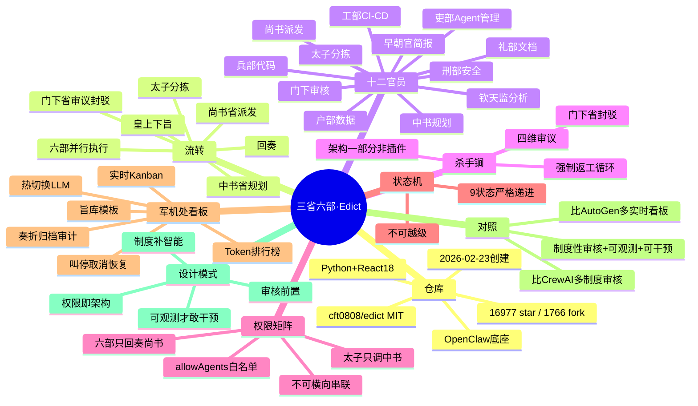

# 三省六部 · Edict 调研报告

> 原始仓库：[cft0808/edict](https://github.com/cft0808/edict)
> 调研日期：2026-10-08 · 作者微信号 CFT0808

## 一句话

把唐朝三省六部制搬进 AI 世界的多 Agent 编排系统：12 个专职 AI 官员（太子 + 三省 + 六部 + 钦天监 + 早朝官），你的每条任务都被当作"圣旨"，经历**分拣 → 规划 → 审核 → 派发 → 执行 → 回奏**的完整流转。核心卖点：**门下省专职审核、可封驳**（制度性质量关卡）+ **军机处实时看板**（全程可观测、可叫停）。

## 硬数据（2026-10-08 实测）

| 项目 | 数据 |
|---|---|
| 仓库 | cft0808/edict，MIT |
| star / fork | 16,977 / 1,766（3 月初媒体报道时 6.5K，半年涨 2.6 倍） |
| 创建 / 最近推送 | 2026-02-23 / 2026-09-28 |
| Agent 数 | 12（太子 1 + 三省 3 + 六部 6 + 钦天监 1 + 早朝官 1） |
| 技术栈 | Python 3.9+（后端仅标准库 stdlib only）+ React 18 看板 |
| 运行底座 | OpenClaw（多 Agent 调度）；无 OpenClaw 也可用 Docker 一键跑 Demo（`cft0808/sansheng-demo`） |
| 文档 | 中/英/日三语 README，另有架构文档 `docs/task-dispatch-architecture.md` |

## 为什么是三省六部：要解决的问题

大多数 Multi-Agent 框架的套路是"来，你们几个 AI 自己聊，聊完把结果给我"——结果是黑盒：无法复现、无法审计、无法干预。Edict 的诊断是：**用一群不可靠的个体 AI Agent，搭出一个高可靠的系统**，靠的不是更聪明的模型，而是 1300 年前就验证过的制度——分权制衡。

```
你（皇上）→ 太子（分拣）→ 中书省（规划）→ 门下省（审议/封驳）→ 尚书省（派发）→ 六部（并行执行）→ 回奏
```

## 十二官员职责

| 官员 | 职责 | 擅长 |
|---|---|---|
| 太子 | 消息第一接收人，分拣闲聊 vs 旨意；闲聊自己回，旨意提炼后转交中书 | 闲聊识别、旨意提炼、标题概括 |
| 中书省 | 接旨、规划、拆解子任务、设计方案 | 需求理解、任务分解、方案设计 |
| 门下省 | 专职审议：可行性/完整性/风险/资源四维审查，**不合格直接封驳打回** | 质量评审、风险识别、标准把控 |
| 尚书省 | 派发、协调、汇总，六部的总调度 | 任务调度、进度跟踪、结果整合 |
| 户部 | 数据、资源、核算 | 数据处理、报表生成、成本分析 |
| 礼部 | 文档、规范、报告 | 技术文档、API 文档、规范制定 |
| 兵部 | 代码、算法、巡检 | 功能开发、Bug 修复、代码审查 |
| 刑部 | 安全、合规、审计 | 安全扫描、合规检查、红线管控 |
| 工部 | CI/CD、部署、工具 | Docker 配置、流水线、自动化 |
| 吏部 | Agent 管理 | Agent 注册、权限维护 |
| 钦天监 | 数据分析、性能度量、趋势预测 | 日志解析、指标聚合、容量规划 |
| 早朝官 | 每日简报（独立，不参与流转） | — |

## 核心机制

### 1. 门下省封驳：制度性审核（杀手锏）

- 不是可选插件，是架构的一部分：**每一个旨意都必须经过门下省，没有例外**
- 四维审议：可行性（技术路径可实现？）、完整性（子任务覆盖全？）、风险（故障点？回滚方案？）、资源（工作量合理？）
- 结论只有两种：「准奏」放行，或「封驳」打回中书省重做，直到达标
- 对应 CrewAI/AutoGen 的"做完就交"：Edict 认为不受制约的权力必然出错，质量关卡必须前置到执行之前

### 2. 权限矩阵：分权写进代码

`agents.json` 里每个 agent 的 `allowAgents` 白名单就是制度的落地：

- 太子 → 只能调中书省（不能越级指挥六部）
- 中书省 → 门下省、尚书省
- 门下省 → 尚书省、中书省（封驳打回的通道）
- 尚书省 → 三省 + 六部（唯一的总调度）
- 六部 → 只能回奏尚书省（**不能横向串联**，杜绝私下结盟）
- 早朝官 → 谁也不能调（独立观察者）

### 3. 状态机：9 个状态严格递进

Pending → Taizi → Zhongshu → Menxia → Assigned → Doing/Next → Review → Done/Cancelled。任务不可越级流转，门下省封驳则打回重走。

### 4. 军机处看板：完全可观测 + 实时可干预

- React 18 实时看板：任务按状态列展示，每张卡片标注流经部门，支持**叫停 / 取消 / 恢复**
- 任务详情：完整流转链、执行部门、流转日志
- 奏折阁：任务完成后自动归档为"奏折"，附五阶段时间线，可一键复制为 Markdown——完整审计能力
- 官员总览：Token 消耗排行榜；模型配置：每个 Agent 独立热切换 LLM；另有旨库（9 个圣旨模板）、天下要闻（资讯推送）等 10+ 面板

## 与主流框架对照（官方自述口径）

| | CrewAI | MetaGPT | AutoGen | **三省六部** |
|---|---|---|---|---|
| 审核机制 | 无 | 可选 | Human-in-loop | **门下省专职审核 · 可封驳** |
| 实时看板 | 无 | 无 | 无 | **军机处 Kanban + 时间线** |
| 任务干预 | 无 | 无 | 无 | **叫停 / 取消 / 恢复** |
| 流转审计 | — | — | 无 | **完整奏折存档** |
| Agent 健康监控 | 无 | 无 | 无 | **心跳 + 活跃度检测** |
| 热切换模型 | 无 | 无 | 无 | **看板内一键切换 LLM** |
| 部署难度 | 中 | 高 | 中 | **低 · 一键安装 / Docker** |

核心差异官方总结为三词：**制度性审核 + 完全可观测 + 实时可干预**。

## 技术亮点

- 后端**仅 Python 标准库**（stdlib only），零重型依赖
- 每个 Agent 的人格/职责写在各自 `SOUL.md`（如 `agents/menxia/SOUL.md`）——"记忆即文档"模式
- 看板操作全部经 CLI 脚本（`scripts/kanban_update.py state/flow/progress`），Agent 被强制要求实时上报进展
- 数据融合：flow_log + progress_log + session JSONL → 统一活动流

## 设计模式提炼

1. **制度补智能**：承认单个 Agent 不可靠（会幻觉、会忘事），用 1300 年的分权制衡把不可靠个体组成可靠系统——"让好汉查好汉"。
2. **审核前置而非后置**：质量关卡放在执行之前（门下省审方案），而不是事后 review 产出。类比：CI 门禁 vs 上线后复盘。
3. **权限即架构**：allowAgents 白名单把"谁能指挥谁"写死，六部不能横向串联——组织架构用代码强制执行，而非靠 prompt 自觉。
4. **可观测是干预的前提**：实时看板 + 叫停/恢复 + 完整审计，人才敢把复杂任务交给 Agent。"黑盒 autonomously 跑"和"白盒可干预地跑"是两种产品哲学。

## 出圈与反响

- 2026 年 3 月在 GitHub 华人程序员圈走红，观察者网/盒饭财经报道（报道时 6.5K star）
- 美卡论坛评论："用户是在 cosplay 皇帝吗""锦衣卫这个绝了，就是 Monitoring Agent"
- 有网友建议出各朝代/各国版本

## 思维导图



交互版：[mindmap.html](./mindmap.html)

---
*原始仓库：https://github.com/cft0808/edict · 架构文档：https://github.com/cft0808/edict/blob/main/docs/task-dispatch-architecture.md*
